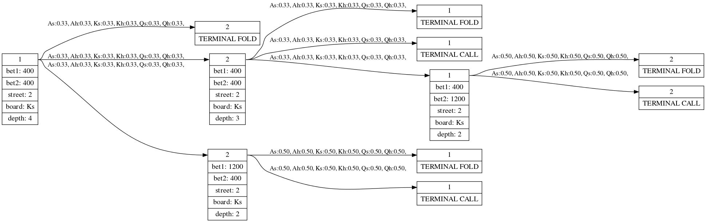

# Tutorial

This file introduces the user to the DeepStack codebase. After an initial
overview of the codebase, it walks the user through a series of examples
meant to illustrate the internal structure of DeepStack. If you are interested
only in how to run DeepStack itself, you may skip to @{tutorial.md.ACPC_Server|here}.

## Code Structure

DeepStack is written in [Lua](https://www.lua.org/) using the [torch](http://torch.ch/)
scientific computing framework. The code files are in the `Source/` directory,
divided into subdirectories based on purpose. All of the code uses relative
paths, and thus will only work if you **run torch from the `Source/` directory**.

The `Source/Game/` and `Source/TerminalEquity/` directories contain modules
that implement aspects of poker games (e.g. handling private and public cards,
evaluating terminal states). 

The `Source/Tree/` directory contains modules that build a tree representing
all or part of a Leduc Hold'em game.

The `Source/Lookahead/` directory uses a public tree to build a **Lookahead**,
the primary game representation DeepStack uses for solving and playing games.
A Lookahead efficiently stores data at the node and action level using
[torch tensors](https://github.com/torch/torch7/blob/master/doc/tensor.md).
When possible, tensors will be stored on the GPU, which will be used for
computation.

The `Source/DataGeneration/` directory contains code which solves random poker
situations using Lookaheads and saves the results to disk. The code in
`Source/Training/` uses this data to train a neural net. The code for directly
interacting with the neural net is contained in `Source/Nn/`.

The `Source/Player/` directory contains the code that implements the continual
re-solving algorith during gameplay, as well as the DeepStack player object
which connects to the server and runs the main DeepStack loop. Communication
with the server is handled by the code in `Source/ACPC/`.

The `Data/Models/` contains trained neural networks to be used during the continual resolving

The `Data/Dot/` is where the images of trees are stored when you want to visualise them

## Trees
Tree is the simplest game representation used throughout the code. It can be
used to visualise simple strategies, compute exploitabilities etc. The
re-solving lookahead is also using tree.

### Building a Simple Tree

Let's start with a simple tree for the second round of Leduc. The following
code builds a game tree rooted at the first node of Leduc's second betting
round, after the King of Spades has been dealt as a public card. Each player
has committed 300 chips to the pot in the first betting round - note that the
actual first round actions are not needed, and thus aren't specified.

```lua
local builder = PokerTreeBuilder()

local params = {}

params.root_node = {}
params.root_node.board = card_to_string:string_to_board('Ks')
params.root_node.street = 2
params.root_node.current_player = constants.players.P1
params.root_node.bets = arguments.Tensor{300, 300}

local tree = builder:build_tree(params)
```

you can find the full example in `Source/Tree/Test/test_tree_builder.lua`.
To run the example, you need to run torch from the `Source/` directory.
```bash
th Tree/Tests/test_tree_builder.lua
```

If the code runs correctly, no output will be produced; it simply creates the
tree and then exits. To look at the structure of the tree, we will need to
use it to produce a visualisation.

### Visualising a Tree

First, make sure you have [graphviz](http://graphviz.org/) installed - if it is
installed correctly, you will be able to run `dot -V` from a terminal.

Once you have built a tree, you may print it into a file for further inspection.

```lua
local visualiser = TreeVisualiser()
visualiser:graphviz(tree, "tree1")
```
[](tree1.png)

You can find the full example in `Source/Tree/Test/test_tree_visualiser.lua`.
To run the example, you need to run torch from the `Source/` directory.
```bash
th Tree/Tests/test_tree_visualiser.lua
```

The resulting image (in `Data/Dot/tree1.svg` shows the structure in the tree,
such as current bets and the strategies in all of the nodes.

### Bet Sizing
The tree that you just produced only contains `fold`, `call`, `pot bet` and
`all-in` actions. To change what bet sizes are used in the tree, open
`Source/Settings/arguments.lua`. The file contains multiple arguments you can
change, including `params.bet_sizing = {1}` which specifies the allowed bet
sizes.  Try changing it into `params.bet_sizing = {1, 2}` to allow not only
pot-sized bets,  but also bets of twice the pot size. To see the results, run
```bash
th Tree/Tests/test_tree_visualiser.lua
```
again.

These bet sizes will limit the options the agent considers when making an
action during the game. Note that this does **not** limit the agent from
understanding any other bet size the opponent can make.
This is a key property of the DeepStack algorithm (continual re-solving),
where the re-solving starts in the exact game node (thus DeepStack perfectly
understands the pot size, possible hands, etc.).

## Solving a Tree

When we build a simple tree, the strategy in each node is random.

### Computing Exploitability

Since the initial strategy in the tree is random, let's see how good the
strategy actually is. To do that, we need to compute the `exploitability` of
the strategy

```lua
local tree_values = TreeValues()
tree_values:compute_values(tree)

print('Exploitability: ' .. tree.exploitability .. ' [chips]')
```
you can find the full example in `Source/Tree/Test/test_tree_values.lua`.
To run the example, you need to run torch from the `Source/` directory.
```bash
th Tree/Tests/test_tree_values.lua
```

You should see an exploitability a bit over **175 chips**. This means that
a worst-case opponent can beat the random strategy for an average of 175 chips
every hand; unsurprisingly, a random strategy is very bad.

Next, we will try to fill the tree with a better strategy.

### Tree CFR

One way to compute a better strategy for the tree is to run Counterfactual
Regret Minimization (CFR) on the tree. If the tree is small (like our example
tree), we can efficiently run the algorithm directly on the tree. Let's do
that.

```lua
local starting_ranges = arguments.Tensor(constants.players_count, constants.card_count)

starting_ranges[1]:copy(card_tools:get_uniform_range(board))
starting_ranges[2]:copy(card_tools:get_uniform_range(board))

local tree_cfr = TreeCFR()
tree_cfr:run_cfr(tree, starting_ranges)
```

you can find the full example in `Source/Tree/Test/test_tree_cfr.lua`
To run the example, you need to run torch from the `Source/` directory.

```bash
th Tree/Tests/test_tree_cfr.lua
```

After 1,000 iterations of CFR, the exploitability of the resulting strategy
should be about **1.0 chips**. This is much better than the random strategy!
Note that you can change the number of iterations in
`Source/Settings/arguments.lua`, look for the `params.cfr_iters` and
`params.cfr_skip_iters` settings.

### Continual Re-solving in Tree

While the CFR is a great algorithm that can solve very large trees, if the tree
is huge (as in no-limit poker), we can't do even a single tree traversal.
That's where DeepStack comes in with the continual re-solving and depth-limited
search. While DeepStack can run on huge trees such as no-limit poker, we can
also run it on our simple example tree to see what it does.

```lua
local filling = TreeStrategyFilling()

local range1 = card_tools:get_uniform_range(board)
local range2 = card_tools:get_uniform_range(board)

filling:fill_strategies(tree, 1, range1, range2)
filling:fill_strategies(tree, 2, range1, range2)
```

You can find the full example in `Source/Tree/Test/test_tree_strategy_filling.lua`.

```bash
th Tree/Tests/test_tree_strategy_filling.lua
```

You shold see a number around **1.37 chips**. While this is slightly worse than
running CFR for 1,000 iterations, DeepStack never traverses the entire tree when
computing the strategy for any node! When re-solving nodes on the first street, 
we estimate the values at the end of the street using a neural network.

Note that we traverse the tree and in each node perform continual re-solving,
first for the first player, and then for the second player. While re-solving
the nodes on the first street, it internally uses a pre-computed neural network.

This is of course a very simple tree for which we can run DeepStack in every 
node of the tree and consequently compute DeepStack's exact strategy for the
game. But since DeepStack does not traverse the full tree, we can run it on
much much larger games than CFR.

To run DeepStack on the full game, we will need to actually play the game in a
dynamic fashion (randomly dealt cards, two players each choosing actions
depending on the current state), which requires the ACPC server. 
  
## ACPC Server

Now let's see how to play the game versus an opponent using the ACPC dealer and
ACPC protocol. The latest ACPC software can be always found [here](http://www.computerpokercompetition.org/downloads/code/competition_server/),
but we already included all you need to run Leduc in the `ACPCServer/` directory.
Open the directory and build the server executable by running

```bash
make
```


### ACPC Dealer

The ACPC dealer is the program that the players talk to over the network using
the ACPC protocol. It deals the cards, determines the winner, etc. - just like
a real dealer does. To start the dealer to play 100 leduc hands and to listen
for the players on ports 20000 and 20001, run

```bash
./dealer test leduc.game 100 42 player1 player2 -p 20000,20001
```
in the `ACPCServer/` directory.

You can get more details by running `./dealer` with no arguments.


### ACPC Example Player

Now let's connect a dummy player to the running dealer.

```bash
./example_player leduc.game localhost 20001
```

Run this code in a separate process from the already running dealer.

The example player simply acts randomly. Connect annother example player to
port 20000 (run `./example_player leduc.game localhost 20000` in a third
process) and look at the dealer's output. You should see 100 hands played, and
at the end, the cumulative winnings of the players. Note that for both
`./dealer` and `./example_player` we specified `leduc.game` - this file defines
that we are playing the game of Leduc hold'em. The ACPC dealer can run other
poker games as well.

### DeepStack Player

Now let's connect DeepStack as a player.

#### Running the Player

The script that runs the player is in `Source/Player/deepstack.lua`. To connect
DeepStack as one of the players to the dealer, open `Source/Settings/arguments.lua`
and set `acpc_server = "localhost"` and `acpc_server_port = 20000`.
Then you can run the player

```bash
th Player/deepstack.lua
```

#### How it Works

DeepStack can also serve as an ACPC player. It's important to understand the
high-level idea and structure of the code.
DeepStack computes the strategy via continual re-solving with a depth limited
search. As we saw for the simple tree, we can run the DeepStack algorithm in a
tree by traversing all of the paths. When playing via ACPC, we re-solve on the
path that is being played. The node we are currently in as well as the actions
that led to the node are included in the ACPC protocol. The API for continual
re-solving can be found in `Source/Lookahead/resolving.lua`. This API is used
both while traversing a simple tree (`Source/Tree/tree_strategy_filling.lua`)
and when running the DeepStack algorithm during the ACPC gameplay
(`Source/Player/continual_resolving.lua`).

## GPU Support

The solver `Source/Lookahead/lookahead.lua` internally uses torch tensors, and
can do all of the computation on the GPU. First, you need to install
[cutorch](https://github.com/torch/cutorch). 
Important! This code is written for version 1.0 so please install with 

```bash
luarocks install cutorch 1.0-0
```

Once installed, you can make
DeepStack run on gpu by setting `params.gpu = true` in `Source/Settings/arguments.lua`.

If you try to run DeepStack for Leduc on a GPU, it will actually run slower
than it does on a CPU. This is because Leduc is such a small game; for Texas
hold'em, there are more than 1,000 hands in each range vector, so the
corresponding tensors are much larger, which allows the GPU to perform
efficient parallel computation. On the other hand, Leduc has only 6 possible
hands in each range vector. Note that the solver is written in a GPU-friendly
manner, and for large games, the solver runs **much** faster on a GPU.

## Creating Your Own Models

If you followed this tutorial, you played deepstack using a neural net model
included in the repository. There is also code for you to train your own neural
network, so let's do that now.

### Data Generation
First, you need to generate and solve random poker situations that will form
the data set for training. Generating more training data is the easiest way to
get better performance from the neural network (the pretrained network that we
included for you was trained on 1,000,000 data points).

The script that handles data generation can be found in `Source/DataGeneration/main_data_generation.lua`.
You should see something like

```lua
data_generation:generate_data(arguments.train_data_count, arguments.valid_data_count)
```

Again, you can set these in `Source/Settings/arguments.lua`.
Let's start small and generate 100 training and 100 validation examples.
Set the corresponding arguments and then run the script.

```bash
th DataGeneration/main_data_generation.lua
```

Once the script finishes, you will find your data in `Data/TrainSamples/PotBet`.

Note that the betting abstraction used for the data generation is the same as
the one DeepStack uses during play (defined by the `params.bet_sizing` argument
that we discussed earlier). So you can easily generate data using different
betting abstractions, which is another way to potentially improve neural net
performance.

### Training Your Model
Now let's train your neural network model on the data you just generated.
First, check the neural net architecture defined as `params.net` in `Source/Settings/arguments.lua`.
You should see something like:

```lua
params.net = '{nn.Linear(input_size, 50), nn.PReLU(), nn.Linear(50, output_size)}'
```
This defines a net with two hidden layers, each of which contains 50 neurons.
Between the layers is a [parameteric rectified linear unit](https://arxiv.org/abs/1502.01852)
transfer function.

The pre-trained net also had 50 neurons per layer, but had 5 hidden layers. The
more data you generate, the bigger your net will probably need to be to
accurately learn the data.

Further training parameters can also be found in the arguments (e.g. learning rate).

Now, the script that runs the training is `Source/Training/main_train.lua` so try running it.

```bash
th Training/main_train.lua
```

You should see output with training and validation loss after each epoch. The
models are saved in `Data/Models/PotBet`. The frequency of saving depends on
the `params.save_epoch` argument in `Source/Settings/arguments.lua`.

### Using Your Model in DeepStack
Now you have your model, you know the validation error, and you wonder how well
it actually plays. Simply open `Source/Settings/arguments.lua` and change `params.value_net_name` 
from `'final'` to the name of the model you want to use, such as `'epoch_10'`.

That's it! Now you can run again
```lua
th Tree/Tests/test_tree_strategy_filling.lua
```
to re-solve the small tree and see the exploitability of your new model.

### Moving a Model between CPU and GPU

If you trained your model on the GPU, but want to run DeepStack on a machine
that has no GPU, you need to convert the model. There is a simple script 
`Source/Nn/cpu_gpu_model_converter.lua` that does exactly that. It also
contains a function for converting from a CPU model to a GPU model, if you
need to do the conversion the other way.